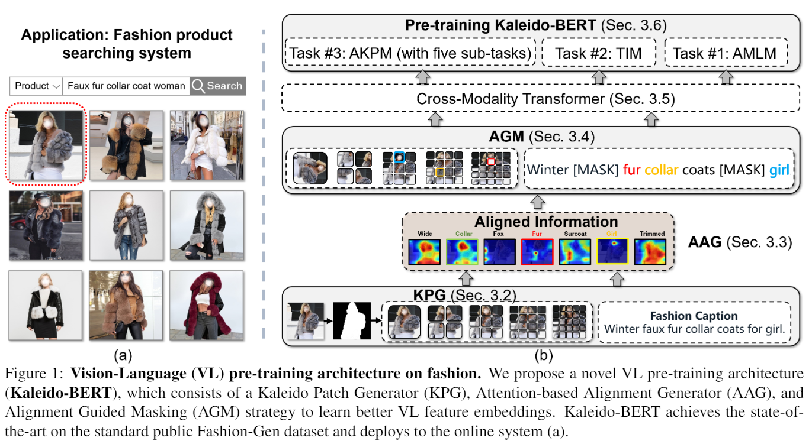

<p align="center"></p>
 
Mingchen Zhuge*, Dehong Gao*, Deng-Ping Fan#, Linbo Jin, Ben Chen, Haoming Zhou, Minghui Qiu, Ling Shao.

[**[Paper]**](https://arxiv.org/pdf/2103.16110.pdf)[**[中文版]**](https://github.com/mczhuge/Kaleido-BERT/blob/main/CVPR2021_KaleidoBERT_Chinese.pdf)[**[Video]**](http://dpfan.net/wp-content/uploads/Kaleido-BERT.mp4)[**[Poster]**](https://github.com/mczhuge/Kaleido-BERT/blob/main/CVPR2021_KaleidoBERT_poster.pdf)[**[MSRA_Slide]**](http://dpfan.net/wp-content/uploads/MSRA_Oral_KaleidoBERT_高德宏.pdf)[**[News1]**](https://zhuanlan.zhihu.com/p/365497906)[**[New2]**](https://mp.weixin.qq.com/s/yPJZDeHSj8C5jGKGgDQF0Q)[**[MSRA_Talking]**](https://mp.weixin.qq.com/s/PeBk5vDi7lO8ZFo8FwN10w)[**[机器之心_Talking]**](https://jmq.h5.xeknow.com/s/2ogm2v)


[](https://opensource.org/licenses/MIT)

## Introduction
We present a new vision-language (VL) pre-training model dubbed Kaleido-BERT, which introduces a novel kaleido strategy for fashion cross-modality representations from transformers. In contrast to random masking strategy of recent VL models,  we design alignment guided masking to jointly focus more on image-text semantic relations. 
To this end, we carry out five novel tasks, \ie, rotation, jigsaw, camouflage, grey-to-color, and blank-to-color for self-supervised VL pre-training at patches of different scale. Kaleido-BERT is conceptually simple and easy to extend to the existing BERT framework, it attains state-of-the-art results by large margins on four downstream tasks, including text retrieval (R@1: 4.03\% absolute improvement), image retrieval (R@1: 7.13\% abs imv.), category recognition (ACC: 3.28\% abs imv.), and fashion captioning (Bleu4: 1.2 abs imv.). We validate the efficiency of Kaleido-BERT on a wide range of e-commercial websites, demonstrating its broader potential in real-world applications.
 

## Noted
1) Code will be released in 2021/4/16.
2) This is the tensorflow implementation built on [Alibaba/EasyTransfer](https://github.com/alibaba/EasyTransfer). 
   The plan to release a PyTorch version of Kaleido-BERT has been canceled as a result of my departure from Alibaba Group (Sorry for the inconvenience).
4) If you feel hard to download these datasets, please modify `/dataset/get_pretrain_data.sh`, `/dataset/get_finetune_data.sh`, `/dataset/get_retrieve_data.sh`, and comment out some `wget #file_links` as you want. This will not inhibit following implementation.
   
## Get started
1. Clone this code
```
git clone git@github.com:mczhuge/Kaleido-BERT.git
cd Kaleido-BERT
```
2. Enviroment setup (Details can be found on conda_env.info)
```
conda create --name kaleidobert --file conda_env.info
conda activate kaleidobert
conda install tensorflow-gpu=1.15.0
pip install boto3 tqdm tensorflow_datasets --index-url=https://mirrors.aliyun.com/pypi/simple/
pip install sentencepiece==0.1.92 sklearn --index-url=https://mirrors.aliyun.com/pypi/simple/
pip install joblib==0.14.1
python setup.py develop
```
3. Download Pretrained Dependancy
```
cd Kaleido-BERT/scripts/checkpoint
sh get_checkpoint.sh
```
4. Finetune
```
#Download finetune datasets

cd Kaleido-BERT/scripts/dataset
sh get_finetune_data.sh
sh get_retrieve_data.sh

#Testing CAT/SUB

cd Kaleido-BERT/scripts
sh run_cat.sh
sh run_subcat.sh

#Testing TIR/ITR

cd Kaleido-BERT/scripts
sh run_i2t.sh
sh run_t2i.sh
```
5. Pre-training
```
#Download pre-training datasets

cd Kaleido-BERT/scripts/dataset
sh get_prtrain_data.sh

#Remove existed checkpoint
rm -rf Kaleido-BERT/checkpoint/pretrained

#Run pre-training
cd Kaleido-BERT/scripts/
sh run_pretrain.sh
```

## Acknowlegement
Thanks Alibaba ICBU Search Team and Alibaba PAI Team for technical support.

## Citing Kaleido-BERT
```
@inproceedings{zhuge2021kaleido,
  title={Kaleido-bert: Vision-language pre-training on fashion domain},
  author={Zhuge, Mingchen and Gao, Dehong and Fan, Deng-Ping and Jin, Linbo and Chen, Ben and Zhou, Haoming and Qiu, Minghui and Shao, Ling},
  booktitle={Proceedings of the IEEE/CVF Conference on Computer Vision and Pattern Recognition},
  pages={12647--12657},
  year={2021}
}
```

## Contact
* Mingchen Zhuge (email: mczhuge@gmail.com)
* Dehong Gao (email:dehong.gdh@alibaba-inc.com)    
        
Feel free to contact us if you have additional questions. 
